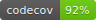

:title: Testing
:author: jen, jon
:description: Test Driven Development 
:keywords: testing, development
:css: style.css

----

Testing
=======

----

Why test
========

* You want to verify that your code is correct 

* You want to find sneaky bugs

* You want to be sure you don't break existing functionality as you add new features (regression) 

----

Tests are a safety net
======================

----

Unit tests vs integration tests
===============================

* Unit tests check a minimal piece of functionality (fast, scale well)

* Integration tests check end-to-end functionality (slower, don't scale well)

----

Writing unit tests helps you write good code
============================================

* You should be thinking about what a function should take as arguments and what it should return _before_ you write it

* "How would I test this code?" accomplishes this

* Good functions also have minimal external dependencies

* Test-Driven Development (TDD) is a style where you first write failing tests, then write the code to get the tests to pass.  

----

Testing in Python
=================

----

.. code-block:: python

    def my_function(meh):

----

Making this a Real Unit Test
============================

* `unittest` is a framework in Python for writing tests

----

Other Testing Frameworks
========================

* `nose`

* `py.test`

----

Selenium + Nightwatch
=====================

Selenium automates web browsing

* (all the  complicated scraping you could want)
* but can be used for testing web-based interfaces

Nightwatch is a node.js-based browser testing solution

----

Nightwatch example
==================

.. code:: js

  'Test background check' : function (browser) {
    browser
    .waitForElementVisible('input#email', 1000)
    .setValue('input#email', 'nightwatch@jonkeane.com')
    [assert all the things]
    .pause(500) // for safari
    .waitForElementVisible('button#languageBGSubmit', 1000)
    .click('button#languageBGSubmit')
    .waitForElementVisible('button#continue', 10000)
    .assert.containsText('body', 'Now we\'re ready to start the
      experiment, first let\'s try a few practice items.')

----

Running Nightwarch
==================

With some configuration (and installing drivers) you can run:

``./node_modules/nightwatch/bin/nightwatch -e chrome``

``./node_modules/nightwatch/bin/nightwatch -e firefox``

``./node_modules/nightwatch/bin/nightwatch -e safari``

----

Testing in R
============

The tidy-verse solution is `testthat` (although there are others). The easiest way is to work within a package-framework.

* need the file: ``tests/testthat.R``
* tests go in ``tests/testthat/test*.R`` 
* use ``context("[some context]")`` for sign posting
* put tests in ``test_that("[something]", {[tests]})``
* test with ``expect_*([evaluation], [optionals])``

----

``tests/testthat.R``
====================

.. code:: R

  library(testthat)
  library([package name])
  
  test_check("[package name]")

----

``tests/testthat/testEx0.R``
============================

.. code:: R

  context("distance calculationss")
  load(file.path('extractedMarkerData.RData')) # markerDataHead
  load(file.path('dist57.RData')) # dist57head
  load(file.path('meanData.RData')) # meanDataHead

  test_that("calculateDistances returns the correct distances", {
    expect_equal(calculateDistances(markerDataHead, c(5,7)),
                 dist57head)
  })

  test_that("meanOnAxis returns the correct distances", {
    expect_equal(meanOnAxis(markerDataHead,
                            c(0, 1, 2, 3, 4),
                            axis ="Y"),
                 meanDataHead)
  })
  

----

``tests/testthat/testEx1.R``
============================

.. code:: R

  context("writeCSVsFromData")
  test_that("writeCSVsFromData will overwrite", {
    expect_message(writeCSVsFromData(pureReplication))
  })
  test_that("writeCSVsFromData checks for existing files", {
    expect_error(writeCSVsFromData(pureReplication,
                                   overwrite=FALSE))
  })
  
  context("checkData runs silently")
  test_that("checkData silently returns the data object 
             it was presented",{
    expect_silent(checkData(pureReplication, 
                  modelMd = modelMetadata))
    expect_equal(checkData(pureReplication, 
                 modelMd = modelMetadata),
                 pureReplication)
  })

----

When to run your test suite
===========================

* You should run your tests often

* You should run your tests when a PR is submitted

* Enter Travis!

----

Travis runs your tests for you
==============================

... and nags you when they fail.

.. image:: images/travis.png

----

Coverage?
=====================================

Code coverage is the amount of code that is tested by a test. There are a bunch of ways to do this: ``codeCov`` and ``coverall`` are two.

This is an inexact science, and can be abused, but is a good sanity check.

----

The best part? Badges!
=====================================

travis:

.. image:: images/travisBuildPassing.svg
    :width: 250px

codeCov:

----

mocapGrip package
=================

Check out testing in action (and all of my bad coding) in R:
https://github.com/jonkeane/mocapGrip

travis:
https://travis-ci.org/jonkeane/mocapGrip

coverage:
https://codecov.io/gh/jonkeane/mocapGrip

----

References
==========

* Ned Batchelder, Getting Started Testing, PyCon 2014: https://www.youtube.com/watch?v=FxSsnHeWQBY
* testthat (with R package development backdrop): http://r-pkgs.had.co.nz/tests.html
* Nightwatch (with selenium): http://nightwatchjs.org/guide#running-tests
