:title: Testing
:author: jen, jon
:description: Test Driven Development 
:keywords: testing, development
:css: style.css

----

Testing
=======

----

Why test
========

* You want to verify that your code is correct 

* You want to find sneaky bugs

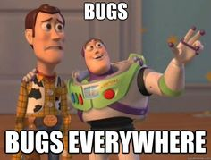

* You want to be sure you don't break existing functionality as you add new features (regression) 

----

Tests are a safety net
======================

----

Unit tests vs integration tests
===============================

* Unit tests check a minimal piece of functionality (fast, scale well)

* Integration tests check end-to-end functionality (slower, don't scale well)

----

Writing unit tests helps you write good code
============================================

* You should be thinking about what a function should take as arguments and what it should return *before* you write it

* "How would I test this code?" makes you think about your code structure

* Good code is modular

* Good code has pieces that each minimal external dependencies

* Test-Driven Development (TDD) is a style where you first write failing tests, then write the code to get the tests to pass.  

----

Testing in Python
=================

Let's write a function that we'll use for temporal cross-validation to make a list of fake todays

----

.. code-block:: python

    def make_fake_todays(pred_window, begin_date="01Jan2014", 
                     end_date="01Jan2016"):
        """Takes first and last date and makes a list of datetime objects

        Args:
            pred_window [int]: size of window in days
            begin_date [str]: first fake_today
            end_date [str]: last fake_today

        Returns:
            generated_todays [list of datetime objects]: fake_todays
        """

    first_today = datetime.datetime.strptime(begin_date, "%d%b%Y")
    last_today = datetime.datetime.strptime(end_date, "%d%b%Y")

    generated_todays = [first_today]
    test_today = first_today

    while test_today + datetime.timedelta(days=pred_window) <= last_today:
        test_today += datetime.timedelta(days=pred_window)
        generated_todays.append(test_today)

    return generated_todays

----

Interactively check code is working correctly
=============================================

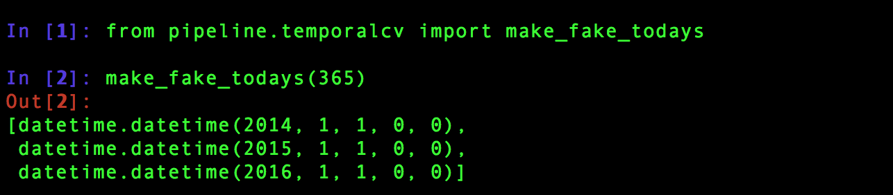

Yay: we are testing a thing

But is the output right?

Every time we make a change to our code, we're going to have to do this again... Boo

----

Put this test into a file
=========================

Now instead of doing this interactively we can just run the file

.. code-block:: python

    from pipeline.temporalcv import make_fake_todays

    print("Actual output:")
    print(make_fake_todays(365))

    print("Expected output:")
    print("[datetime.datetime(2014, 1, 1, 0, 0), ")
    print("datetime.datetime(2015, 1, 1, 0, 0), ")
    print("datetime.datetime(2016, 1, 1, 0, 0)]")

----

Standalone test
===============

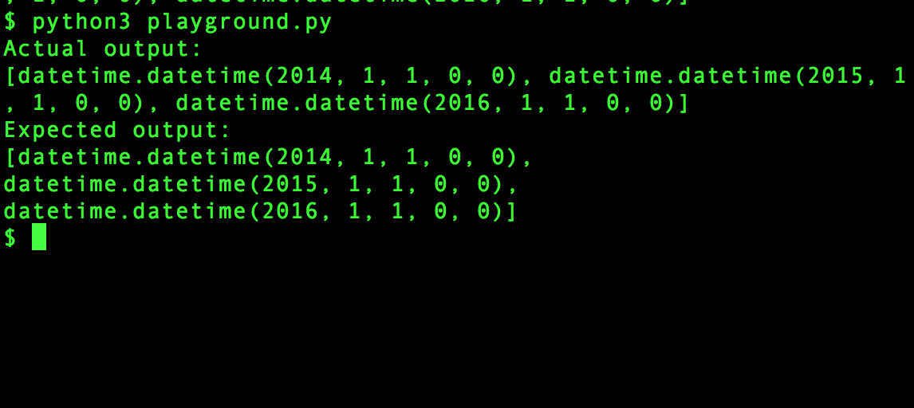

Better! Now whenever we make a change to our code we can just run this file to make sure we still get the right answer

But really we want our test just to tell us if it passes or not. 

----

Let's do a last iteration
=========================

.. code-block:: python

    from pipeline.temporalcv import make_fake_todays

    actual_output = make_fake_todays(365)

    expected_output = ("[datetime.datetime(2014, 1, 1, 0, 0), "
                       "datetime.datetime(2015, 1, 1, 0, 0), "
                       "datetime.datetime(2016, 1, 1, 0, 0)]")

    if str(actual_output) == expected_output:
        print("tests pass")
    else:
        print("tests don't pass")

----

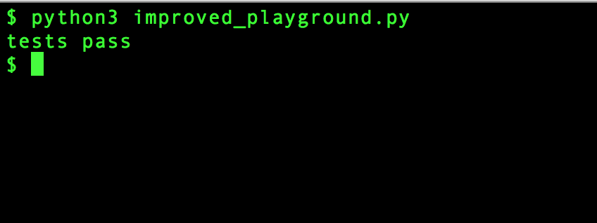

----

Making this a Real Unit Test
============================

* ``unittest`` is a module in Python for writing tests

* Let's convert our test into a test that uses ``unittest``

----

First Real Unit Test
====================

.. code-block:: python

    import unittest
    from pipeline.temporalcv import make_fake_todays

    class TemporalCVTest(unittest.TestCase):
        def test_one_year_fake_todays(self):
            actual_output = make_fake_todays(365)
            expected_output = ("[datetime.datetime(2014, 1, 1, 0, 0), "
                               "datetime.datetime(2015, 1, 1, 0, 0), "
                               "datetime.datetime(2016, 1, 1, 0, 0)]")
            assert str(actual_output) == expected_output

----

Run Tests
=========

``python3 -m unittest tests/test_pipeline.py``

----

Passing Tests
=============

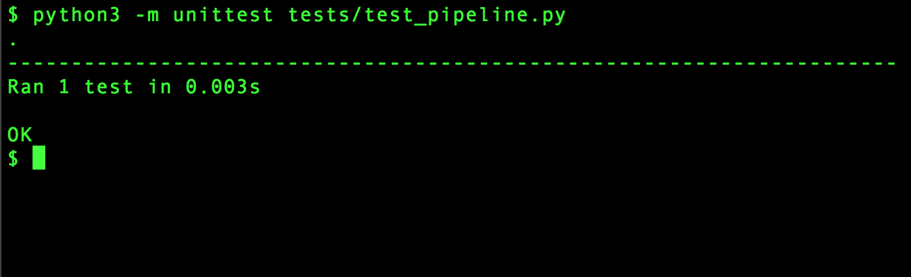

----

Failing Tests
=============

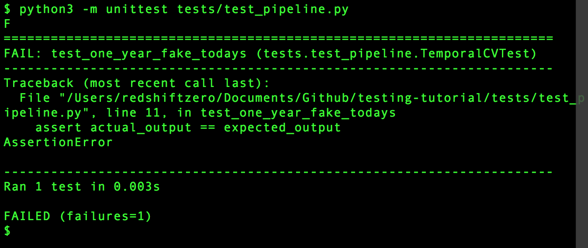

----

Other Testing Frameworks
========================

* ``nose``

* ``py.test``

----

Selenium + Nightwatch
=====================

Selenium automates web browsing

* (all the  complicated scraping you could want)
* but can be used for testing web-based interfaces

Nightwatch is a node.js-based browser testing solution

----

Nightwatch example
==================

.. code:: js

  'Test background check' : function (browser) {
    browser
    .waitForElementVisible('input#email', 1000)
    .setValue('input#email', 'nightwatch@jonkeane.com')
    [assert all the things]
    .pause(500) // for safari
    .waitForElementVisible('button#languageBGSubmit', 1000)
    .click('button#languageBGSubmit')
    .waitForElementVisible('button#continue', 10000)
    .assert.containsText('body', 'Now we\'re ready to start the
      experiment, first let\'s try a few practice items.')

----

Running Nightwatch
==================

With some configuration (and installing drivers) you can run:

``./node_modules/nightwatch/bin/nightwatch -e chrome``

``./node_modules/nightwatch/bin/nightwatch -e firefox``

``./node_modules/nightwatch/bin/nightwatch -e safari``

----

Testing in R
============

The tidy-verse solution is `testthat` (although there are others). The easiest way is to work within a package-framework.

* need the file: ``tests/testthat.R``
* tests go in ``tests/testthat/test*.R`` 
* use ``context("[some context]")`` for sign posting
* put tests in ``test_that("[something]", {[tests]})``
* test with ``expect_*([evaluation], [optionals])``

----

``tests/testthat.R``
====================

.. code:: R

  library(testthat)
  library([package name])
  
  test_check("[package name]")

----

``tests/testthat/testEx0.R``
============================

.. code:: R

  context("distance calculationss")
  load(file.path('extractedMarkerData.RData')) # markerDataHead
  load(file.path('dist57.RData')) # dist57head
  load(file.path('meanData.RData')) # meanDataHead

  test_that("calculateDistances returns the correct distances", {
    expect_equal(calculateDistances(markerDataHead, c(5,7)),
                 dist57head)
  })

  test_that("meanOnAxis returns the correct distances", {
    expect_equal(meanOnAxis(markerDataHead,
                            c(0, 1, 2, 3, 4),
                            axis ="Y"),
                 meanDataHead)
  })
  

----

``tests/testthat/testEx1.R``
============================

.. code:: R

  context("writeCSVsFromData")
  test_that("writeCSVsFromData will overwrite", {
    expect_message(writeCSVsFromData(pureReplication))
  })
  test_that("writeCSVsFromData checks for existing files", {
    expect_error(writeCSVsFromData(pureReplication,
                                   overwrite=FALSE))
  })
  
  context("checkData runs silently")
  test_that("checkData silently returns the data object 
             it was presented",{
    expect_silent(checkData(pureReplication, 
                  modelMd = modelMetadata))
    expect_equal(checkData(pureReplication, 
                 modelMd = modelMetadata),
                 pureReplication)
  })

----

When to run your test suite
===========================

* You should run your tests often

* You should run your tests when a PR is submitted

* Enter Travis!

----

Travis runs your tests for you
==============================

... and nags you when they fail.

.. image:: images/travis.png

----

Travis
======

* Sign up on ``travis-ci.org`` and turn on that repo

* Add a ``.travis.yml`` configuration file to your repo to tell Travis what to do

* Commit and push and Travis will run your tests

* Every time someone commits or submits a PR, Travis will run your tests! 

* See ``https://docs.travis-ci.com/user/getting-started/`` for links to config files

----

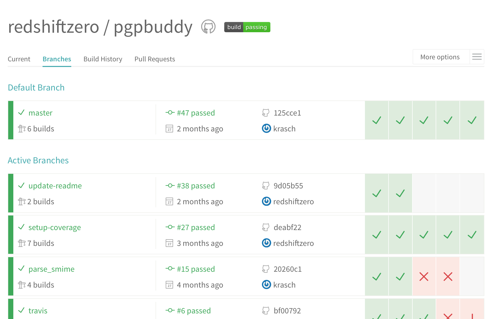

----

Coverage?
=====================================

* You are only checking the code that you have written tests for

* Code coverage is the amount of code that is tested by your test suite

* There are a bunch of ways to do this: ``codeCov`` and ``coverall`` are two

* This is an inexact science, and can be abused, but is a good sanity check

----

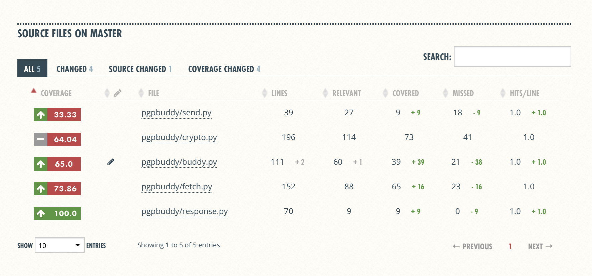

----

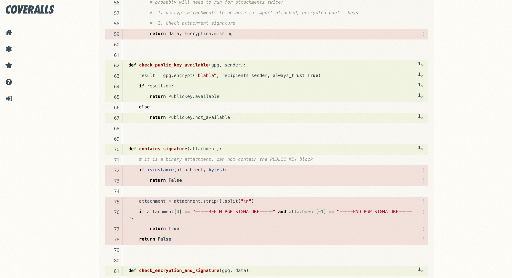

----

Services like this make reviewing PRs much easier
=================================================

----

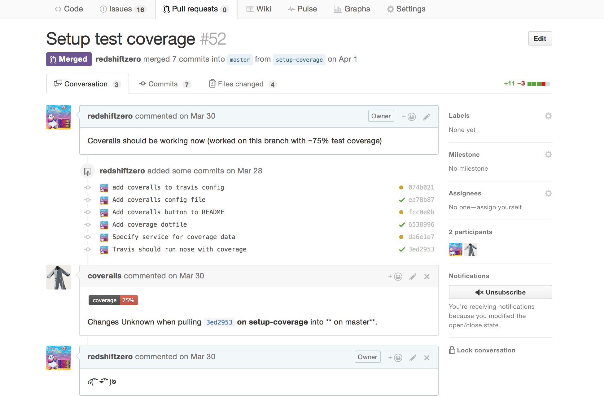

----

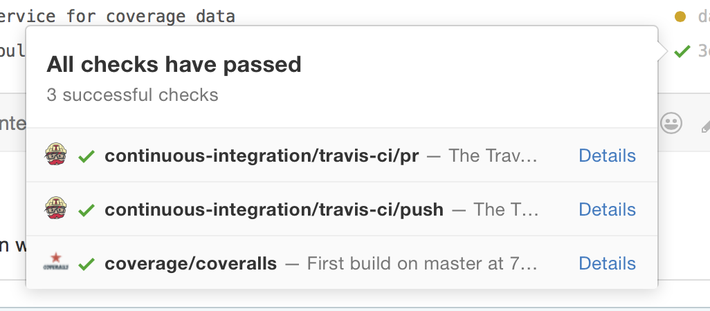

----

The best part? Badges!
=====================================

travis:

.. image:: images/travisBuildPassing.svg
    :width: 250px

codeCov:

.. image:: images/codeCov.svg
    :width: 250px

----

mocapGrip package
=================

Check out testing in action (and all of my bad coding) in R:
https://github.com/jonkeane/mocapGrip

travis:
https://travis-ci.org/jonkeane/mocapGrip

coverage:
https://codecov.io/gh/jonkeane/mocapGrip

----

References
==========

* Ned Batchelder, Getting Started Testing, PyCon 2014: https://www.youtube.com/watch?v=FxSsnHeWQBY
* testthat (with R package development backdrop): http://r-pkgs.had.co.nz/tests.html
* Nightwatch (with selenium): http://nightwatchjs.org/guide#running-tests
